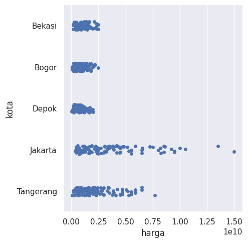

# Analisis Pasar Properti Jabodetabek untuk Ekspansi Kantor Cabang RPPI
> Collaborative Project — Data Analyst & Researcher
## 📌 Project Overview

RPPI membutuhkan insight berbasis data untuk memahami kondisi pasar properti di wilayah **Jabodetabek** (Jakarta, Bogor, Depok, Tangerang, dan Bekasi) sebagai bahan pertimbangan ekspansi kantor cabang. Sebelum masuk ke analisis bisnis, RPPI ingin **mengevaluasi terlebih dahulu kualitas data properti yang mereka miliki**, agar data cukup andal untuk dijadikan dasar pengambilan keputusan.
Project ini menjawab tiga business question berikut:
1. Bagaimana kualitas data properti yang dimiliki perusahaan?
2. Bagaimana karakteristik dan pricing pasar properti, serta apakah terdapat perbedaan harga antarwilayah?
3. Wilayah mana yang berpotensi menjadi lokasi kantor cabang RPPI berikutnya?

## 🔄 Metodologi

1. **Data Understanding**: memahami struktur dataset, variabel, dan kondisi awal data.
2. **Data Preprocessing**
   - *Data cleaning*: pengecekan missing value, duplikasi, konsistensi format dan tipe data, serta kategori atau nilai yang tidak sesuai.
   - *Transformation*: penyeragaman format dan satuan.
   - *Data integration*: penggabungan beberapa sumber data.
3. **Exploratory Data Analysis (EDA)**: analisis distribusi harga, karakteristik properti, dan perbedaan harga antarwilayah.
4. **Dashboard**: visualisasi interaktif untuk menjawab business question 2 dan 3.

## 🔍 Key Findings

- **Kualitas data masih perlu ditingkatkan**
  - Proporsi missing value cukup tinggi di setiap kota.
  - Satuan pada beberapa variabel numerik tidak seragam.
  - Beberapa variabel belum memiliki definisi yang jelas, misalnya luas bangunan.
- **Harga properti Jakarta paling tinggi**: harga di Jakarta cenderung lebih tinggi dibandingkan Tangerang, Depok, dan Bekasi.
- **Depok berpotensi sebagai lokasi ekspansi**: letaknya relatif strategis sebagai penghubung beberapa wilayah Jabodetabek, dengan harga properti yang lebih terjangkau dibandingkan Jakarta.

## 💡 Insight Utama

- **Kualitas data memengaruhi keandalan analisis.** Missing value yang tinggi, satuan yang tidak seragam, dan definisi variabel yang tidak jelas membatasi tingkat kepercayaan terhadap hasil analisis.
- **Terdapat perbedaan harga yang jelas antarwilayah.** Jakarta berada di segmen harga tertinggi, sedangkan Tangerang, Depok, dan Bekasi relatif lebih terjangkau.
- **Kombinasi lokasi strategis dan harga terjangkau menjadikan Depok kandidat yang menarik** untuk kantor cabang berikutnya.

